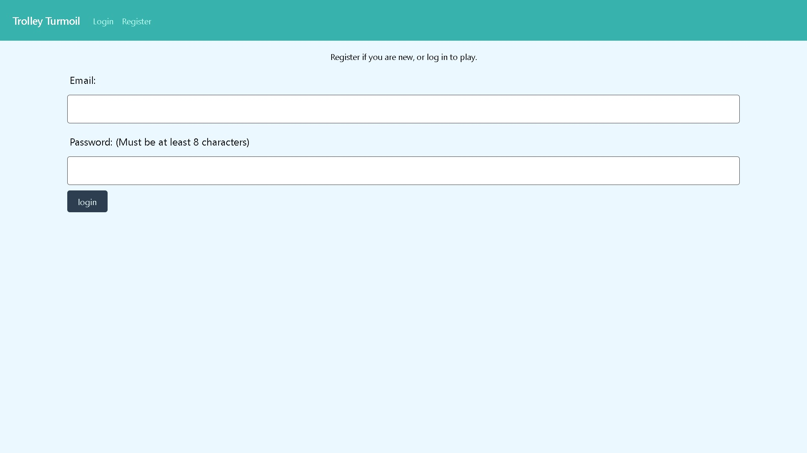
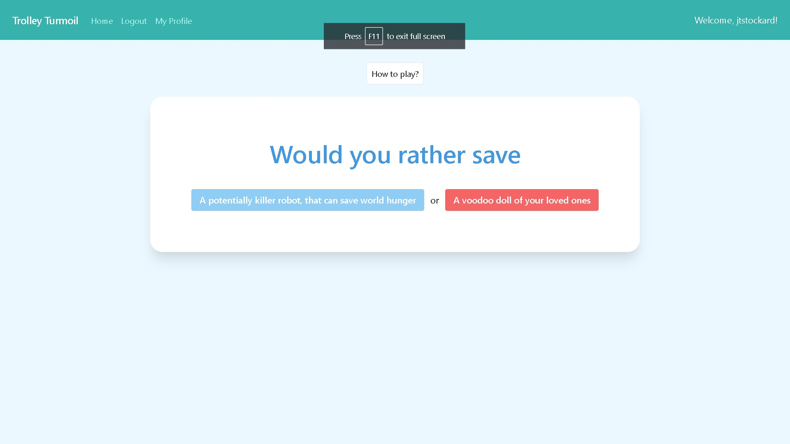
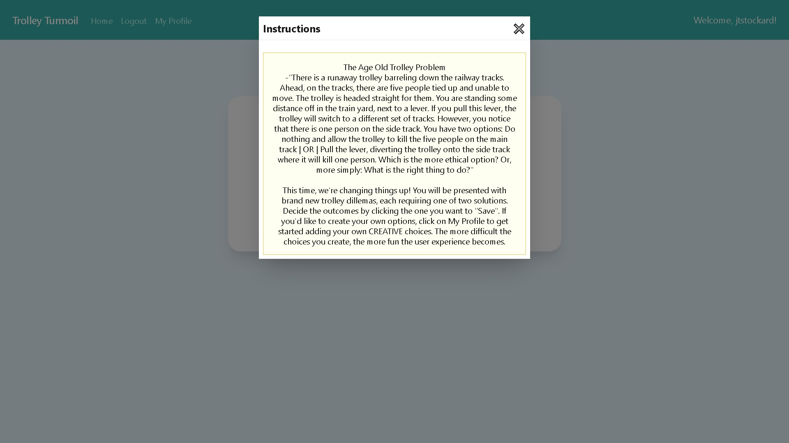
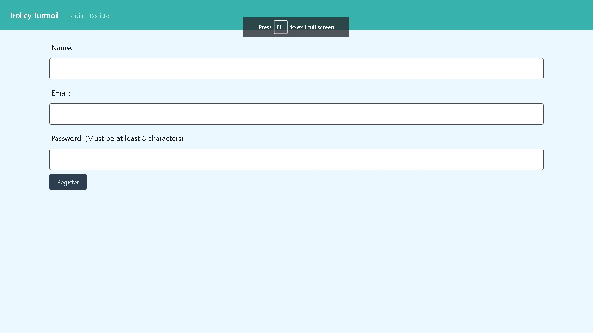
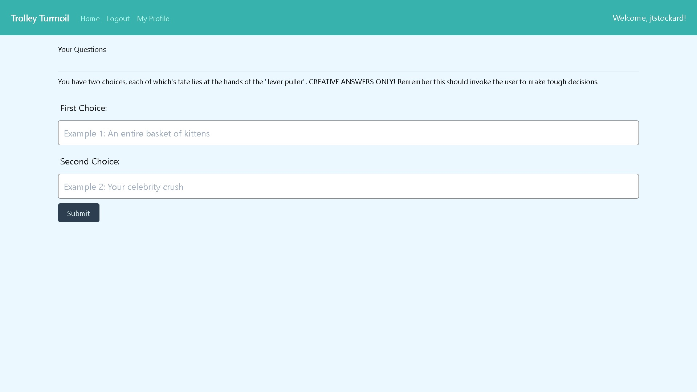
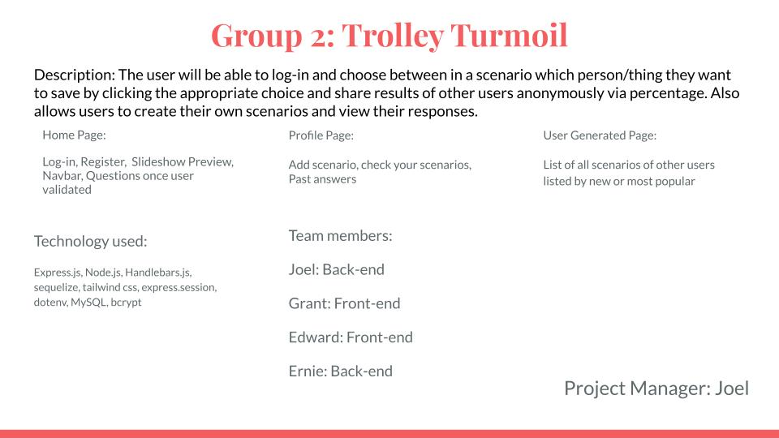

# Project 2: Trolley Turmoil

## Project Goal

The user will be able to play the game of the trolley problem in which you must choose to either let the track run over the first item therefore killing or destorying it, or chose to pull the level and chose the second option which will present you with a moral dilemma.This will keep repeating until you feel your grasp of morally charged situations becomes quicker and eaiser to identify

Future feature: user choices will be visible by the user for past experiences and keep record of all other user choices have made.

The application will be using the Heroku API

## User Story

```
AS A user of morality
I WANT to train and reinforce my ideal scenarios by being prompted continuously
SO THAT I can make better choices for the future
```

## Acceptance Criteria

```
WHEN I open the web application
THEN I am provided with a login page
WHEN I login using seeded data
THEN I am presented with a homepage that shows me how to play and start the game
WHEN I want to register my own username
THEN I present with a form for username, email, and password
WHEN I check what my profile has
THEN I can add more of my own dilemmas and look at ones I've already made
WHEN I play the game by clicking a choice
THEN I am presented with my choice being not able to change it
WHEN I log out of the app
THEN I am brought back to the login screen
```

## Table of Contents

- [Links to Application](#Links)
- [Features](#Features)
- [Development](#Development)
- [Credits](#credits)
- [Collaborators](#Collaborators)

## Links

Below are links to access this live website and repository.

Github: https://github.com/jtstockard/KU-CBC-Project-2-Trolley-Turmoil

Deployed URL: https://ku-cbc-project-2-beardbros.herokuapp.com/

## Features

---

The following image shows the web application's appearance and functionality:

Login feature boots up on startup making it a user based content site that is free and saves info behind bcrypt.



---

When a user clicks on the button associated with the solution to their question, another will present itself with information of the next one.



---

There is also an informative modal on the homepage that will give you a brief synopsis of the app and how to pay it.



---

If you are not a existing user a registry page is avaliable for users at no cost to encourage user generated content.



---

Each user will also have a profile page where they can see questions that they have made and also generate more questions for the database.



---

## Development

The team's initial wireframe is shown below to plan the project and design moving forward.



## Credits

The following people also helped with our developement:

- Bryan B
- Dion L
- Chris S
- Byron F
- David M
  <br>
  The following technologies were used during deployment:

- jQuery: (https://jquery.com/)
- Express.js: (https://expressjs.com/)
- Node.js: (https://nodejs.org/en/)
- Express.session: (https://www.npmjs.com/package/express-session)
- Handlebars.js: (https://handlebarsjs.com/)
- Sequelize: (http://sequelize.org/)
- dotenv: (https://www.npmjs.com/package/dotenv)
- MySQL: (https://www.mysql.com/)
- Bcrypt: (https://www.npmjs.com/package/bcrypt)
- JawsDB: (https://www.jawsdb.com/)
  <br>

Tailwind CSS for styling: (https://tailwindcss.com/).

## Collaborators

Group 2: `Beard Bros 2`

- `Edward Reed` @ https://github.com/relentlessreed
- `Joel Stockard` @ https://github.com/jtstockard
- `Grant Shell` @ https://github.com/GrantShell

## Copyright

All licenses in this repository are copyrighted by their respective authors. Contact the authors if you want a copy of the repository.
